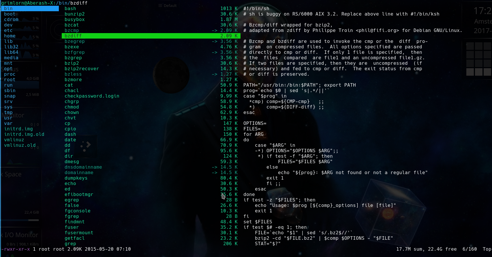
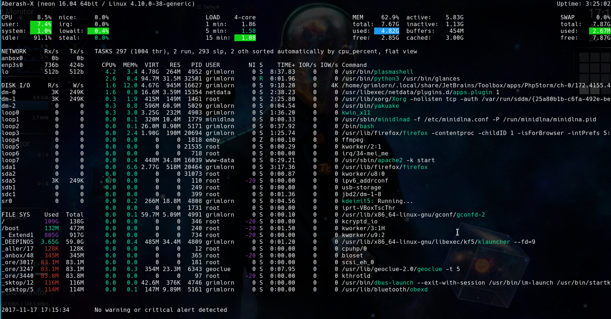

# cli-doc.github.io
My personal Linux Command-Line / Bash cheat sheet.

##Package Handling

######All around installation.
Install applications from PPA ([Personal Package Archive](https://en.wikipedia.org/wiki/Ubuntu_(operating_system)#Package_Archives)) :

 
```
sudo apt install <package>
```

```
sudo aptitude install <package>
```
Install applications from repository (PIP) :

 

1.Python 2x
```
pip install <package>
```
2.Python 3x
```
pip3 install <package>
```
Install applications from `Debian package`:

 

1.chain method
```
cd <directory url of debian package> && sudo dpkg -i ./<file name of debian package>.deb
```
2.direct method
```
sudo dpkg -i ./<directory url of debian package>/<file name of debian package>.deb
```
Install failed :

 
```
sudo apt --purge autoremove <failed package> && sudo dpkg --configure -a && sudo apt update && sudo aptitude install <failed package>
```
######Updating application.

Updating system :

 
```
sudo apt update && sudo apt upgrade && sudo apt --purge autoremove
```
```
sudo aptitude update && sudo aptitude upgrade && sudo apt --purge autoremove
```
Troubleshoot updating:

 
```
sudo dpkg --configure -a
```
######Uninstall application.

Remove applications :


1.standard.
```
sudo apt remove <package>
```
2.removing config files & linked unused libraries.
```
sudo apt --purge autoremove <package>
```
3.advanced uninstall with multiple situations.
```
sudo aptitude remove <package>
```
##Trick & Tips

Bypass spaces in names.

  

example to cd in a directory named `My Directory`.
```
cd /home/Sayid/My\ Directory/
```
Become `root`:


```
sudo su
```
##Command-Line applications

Ranger - File Manager

```
sudo apt install ranger
```
Glances - System Monitor

```
sudo apt install glances
```
##Deprecated Commands

Replaced by `apt`

 

```
apt-get
```